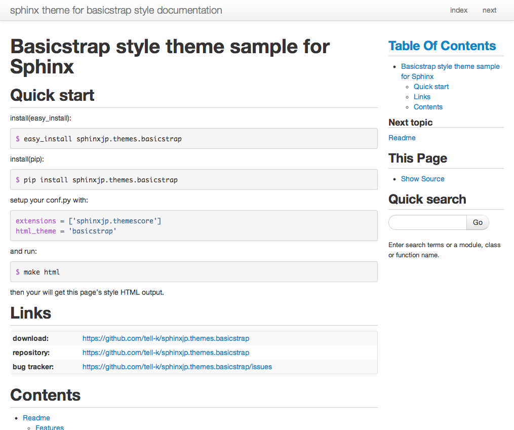
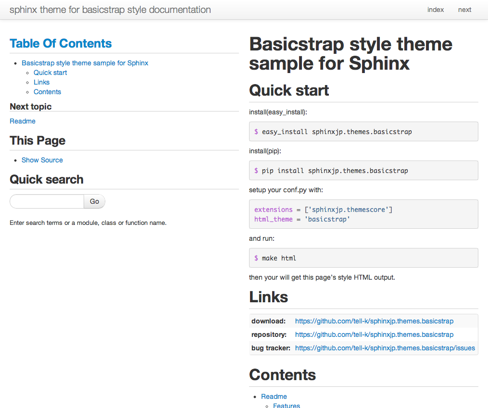
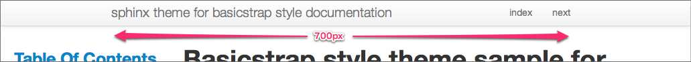
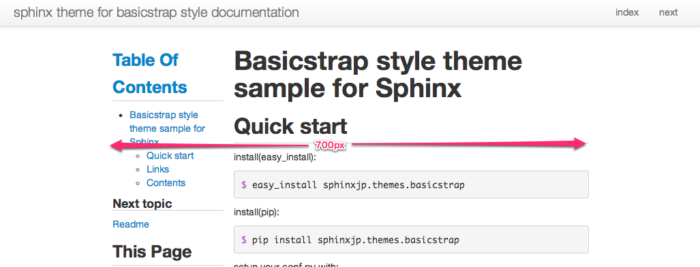
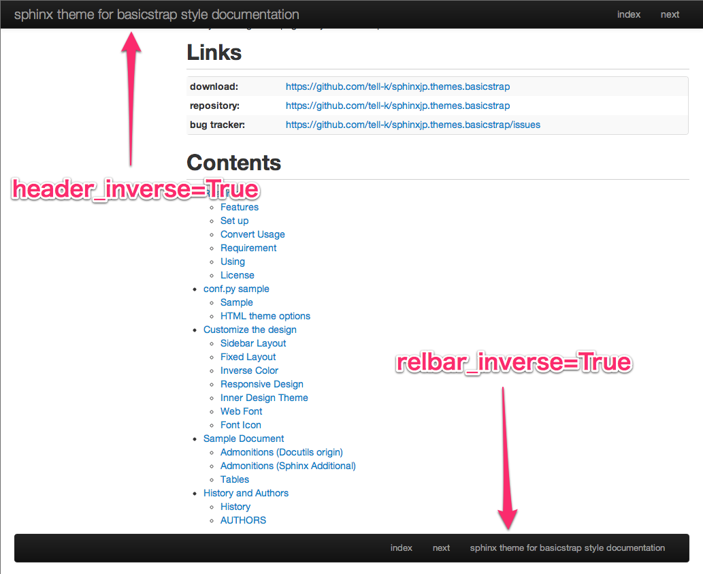
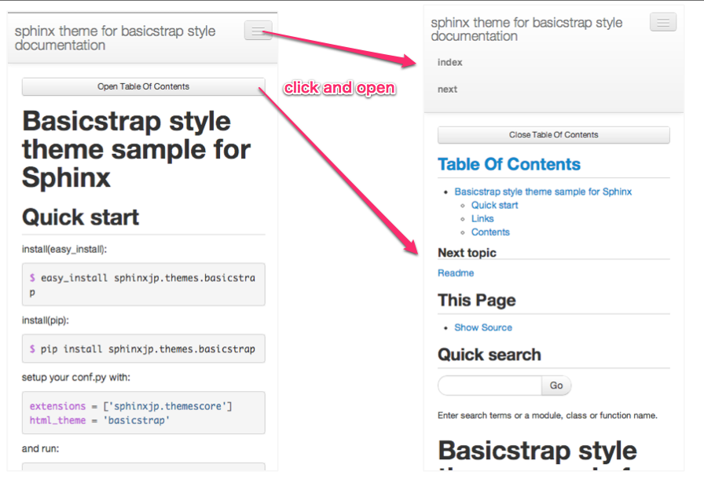
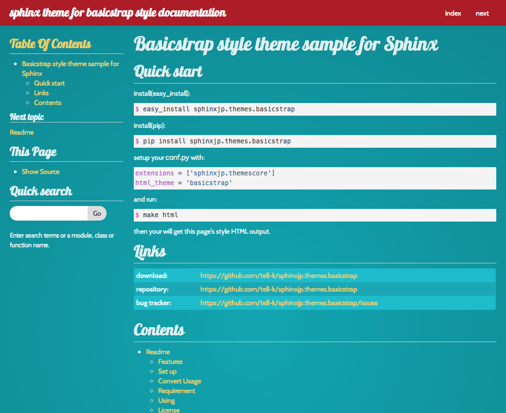
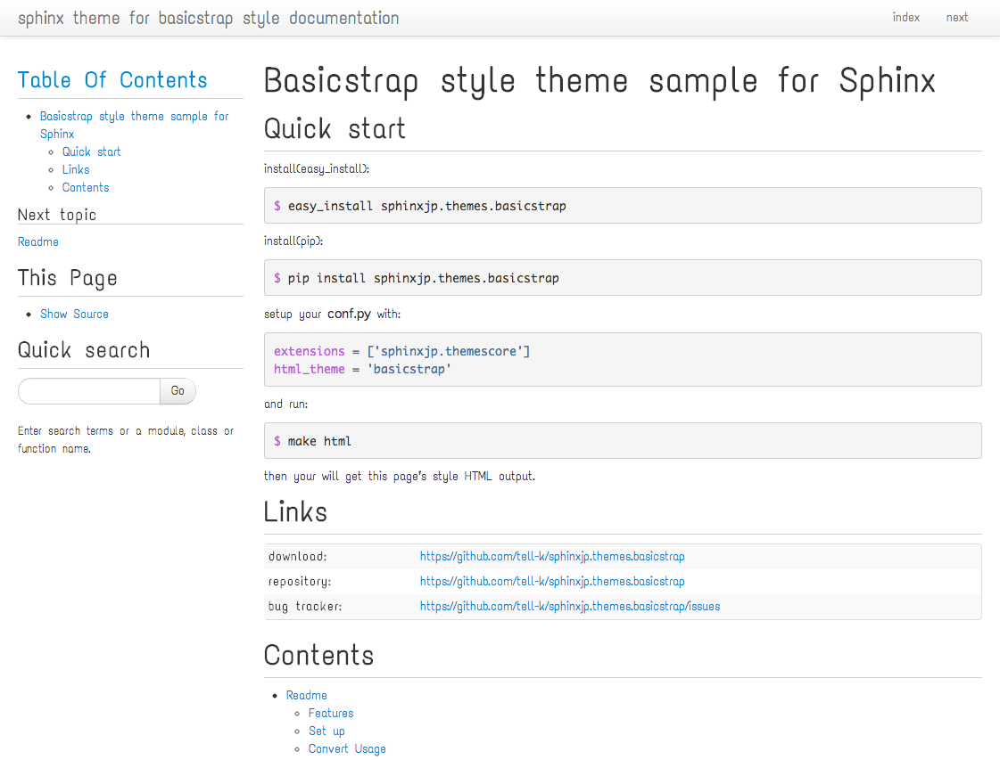

========================
 Customize the design
========================

By setting the html_theme_options in your conf.py, you can change the look and feel some flexibility.
Because it contains an example of a simple configuration, please try to be helpful.

Sidebar layout
========================

Right sidebar
-------------------------------

If you want to place sidebar to the right, please change "rightsidebar" option.

::

  html_theme_options = {
      'rightsidebar': True,
  }

   Figure1: right sidebar

Change sidebar width
-------------------------------

If you want to change the width of the sidebar, please change "sidebar_span" option.

Using `a Grid system of Twitter Bootstrap <http://twitter.github.com/bootstrap/scaffolding.html#gridSystem>`_.

::

  html_theme_options = {
      'sidebar_span': 6, # 1(min) - 12(max)
  }

   Figure2: change sidebar with

No sidebar
-------------------------------

::

  html_theme_options = {
      'nosidebar': True,
  }

.. figure:: _static/img/nosidebar.png
   :width: 50%
   :figclass: figure-polaroid
   :align: center
   :target: _images/nosidebar.png

   Figure3: no sidebar

Fixed layout
========================

Fixed width of Navigation Bar
-----------------------------

::

  html_theme_options = {
    'nav_fixed': True,
    'nav_width': '700px',
  }

   Figure4: navbar fixed

fixed with of Content Area
-----------------------------

::

  html_theme_options = {
    'content_fixed': True,
    'content_width': '700px',
  }

   Figure5: content fixed

Inverse color
========================

::

  html_theme_options = {
    'header_inverse': True,
    'relbar_inverse': True,
  }

   Figure6: inverse color

.. caution:: Caution when upgrading from 0.1.1 to 0.2.0

   * In version 0.1.1, the header color was black in the default, it has become white in 0.2.0.
   * If you like the black color header, please set to True the 'header_inverse' option.

Responsive design
========================

   Figure7: responsive design

If you want to quit Responsive design, please set to True "noresponsive" option.

::

  html_theme_options = {
    'noresponsive': True,
  }

Inner design theme
========================

* `Bootswatch <http://bootswatch.com/>`_ design themes are available.
* `Geo <http://divshot.github.io/geo-bootstrap/>`_ design themes are available.

::

  html_theme_options = {
    'inner_theme': True,
    'inner_theme_name': 'bootswatch-amelia',
  }

   Figure8: inner theme

* avalible inner themes

  * bootswatch-amelia
  * bootswatch-cerulean
  * bootswatch-cosmo
  * bootswatch-cyborg
  * bootswatch-journal
  * bootswatch-readable
  * bootswatch-simplex
  * bootswatch-slate
  * bootswatch-spacelab
  * bootswatch-paper (bootstrap_version 3 only)
  * bootswatch-sandstone (bootstrap_version 3 only)
  * bootswatch-spruce (bootstrap_version 2 only)
  * bootswatch-superhero
  * bootswatch-united
  * bootswatch-darkly(bootstrap_version 3 only)
  * bootswatch-flatly
  * bootswatch-lumen (bootstrap_version 3 only)
  * bootswatch-yeti(bootstrap_version 3 only)
  * geo-bootstrap (bootstrap_version 2 only)

Web Font
========================

`Google Web Fonts <http://www.google.com/webfonts>`_ are available.

::

  html_theme_options = {
    'googlewebfont': True,
    'googlewebfont_url': 'http://fonts.googleapis.com/css?family=Text+Me+One',
    'googlewebfont_style': "font-family: 'Text Me One', sans-serif",
  }

   Figure9: webfont

Font Icon
========================

`Font Awesome <http://fortawesome.github.com/Font-Awesome/>`_ are available.

Please write in this format.

::

 * :fonticon:`fa fa-home`
 * :fonticon:`fa fa-home fa-large`
 * :fonticon:`fa fa-home fa-muted`
 * :fonticon:`fa fa-home fa-spin`
 * :fonticon:`fa fa-home fa-border`
 * :fonticon:`fa fa-home fa-border icon-2x`
 * :fonticon:`fa fa-home fa-border icon-3x`
 * :fonticon:`fa fa-home fa-border icon-4x`

* :fonticon:`fa fa-home`
* :fonticon:`fa fa-home fa-large`
* :fonticon:`fa fa-home fa-muted`
* :fonticon:`fa fa-home fa-spin`
* :fonticon:`fa fa-home fa-border`
* :fonticon:`fa fa-home fa-border fa-2x`
* :fonticon:`fa fa-home fa-border fa-3x`
* :fonticon:`fa fa-home fa-border fa-4x`
